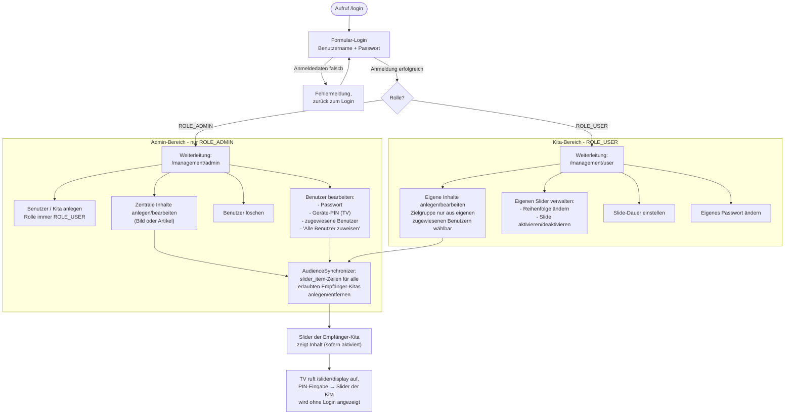
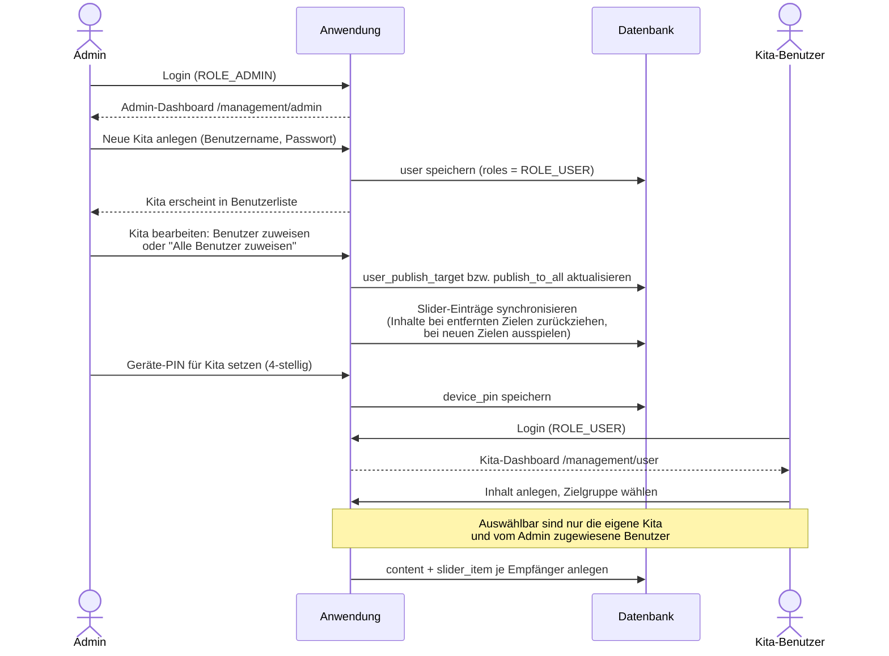
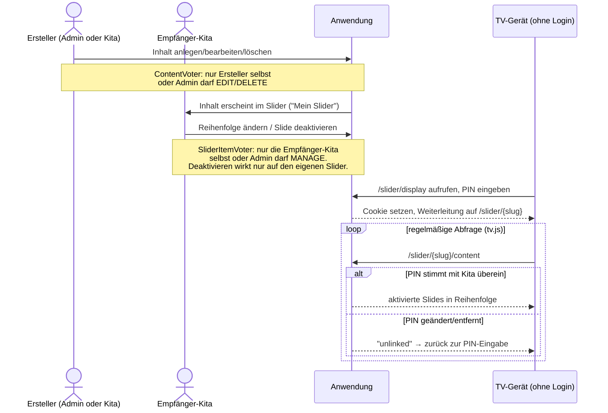
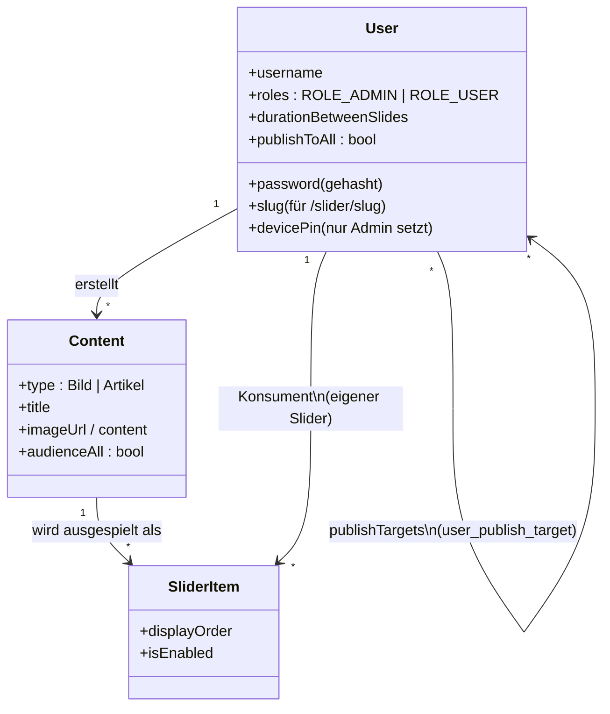

# Autorisierung & Benutzerverwaltung – Testreferenz

Dieses Dokument beschreibt den Soll-Flow der Anwendung rund um **Login, Rollen, Benutzerverwaltung (Admin), zugewiesene Kitas und Slider**. Es dient Anwendern als Anhaltspunkt für Funktionstests.

## Grundprinzip

- Es gibt genau zwei Rollen: `ROLE_ADMIN` (Administrator) und `ROLE_USER` (eine Kita).
- **Jede Kita ist ein Benutzerkonto** – es gibt keine separate Kita-Entität.
- Der Admin verwaltet alle Benutzer und legt fest, **welchen Kitas ein Ersteller Inhalte zuweisen darf** ("Zugewiesene Benutzer" bzw. "Alle Benutzer zuweisen").
- Jede Kita hat genau **einen Slider** (TV-Anzeige), der per 4-stelliger PIN mit einem Gerät gekoppelt wird.

---

## 1. Gesamt-Flow: Login → Rolle → Berechtigungen (Aktivitätsdiagramm)

**Hinweis für Tests:** Ein Admin, der `/management/user` aufruft, wird automatisch auf `/management/admin` umgeleitet – und umgekehrt eine Kita von `/management/admin` auf `/management/user`.

---

## 2. Benutzerverwaltung & Kita-Zuweisung (Sequenzdiagramm)

---

## 3. Slider: Wer darf was? (Sequenzdiagramm inkl. TV)

---

## 4. Datenmodell (Klassendiagramm)

---

## 5. Checkliste für Funktionstests

### Login & Rollen
- [ ] Login mit falschen Daten schlägt fehl, Fehlermeldung erscheint.
- [ ] Admin landet nach Login auf `/management/admin`, Kita auf `/management/user`.
- [ ] Kita kann `/management/admin` nicht aufrufen (Umleitung auf eigenes Dashboard).
- [ ] Admin wird von `/management/user` auf das Admin-Dashboard umgeleitet.
- [ ] Logout beendet die Sitzung.

### Benutzerverwaltung (nur Admin)
- [ ] Admin kann neue Kita anlegen; sie erscheint in der Benutzerliste.
- [ ] Admin kann Passwort einer Kita ändern.
- [ ] Admin kann einer Kita eine 4-stellige Geräte-PIN zuweisen; PIN muss eindeutig sein.
- [ ] Admin kann einer Kita "zugewiesene Benutzer" geben oder "Alle Benutzer zuweisen" aktivieren.
- [ ] Admin kann Kita löschen; deren Inhalte/Slider-Einträge verschwinden.

### Inhalte & Zuweisung
- [ ] Kita sieht bei "Sichtbar für" nur sich selbst und die vom Admin zugewiesenen Benutzer.
- [ ] Zentrale Inhalte des Admins erscheinen im Slider aller erlaubten Kitas.
- [ ] Entzieht der Admin einer Kita ein Ziel, verschwinden dort die bereits ausgespielten Inhalte dieses Erstellers.
- [ ] Nur der Ersteller (oder Admin) kann einen Inhalt bearbeiten/löschen.

### Slider
- [ ] Kita kann Reihenfolge der eigenen Slides ändern (hoch/runter).
- [ ] Kita kann einen Slide deaktivieren – er verschwindet nur aus ihrem eigenen Slider, nicht bei anderen Empfängern.
- [ ] Kita kann die Anzeigedauer pro Slide einstellen.
- [ ] Kita kann Slides anderer Kitas nicht verwalten (direkte URL-Aufrufe werden abgelehnt).

### TV-Anzeige (ohne Login)
- [ ] `/slider/display`: korrekte PIN führt zum Slider der richtigen Kita.
- [ ] Falsche PIN wird abgelehnt.
- [ ] Ändert/entfernt der Admin die PIN, zeigt das gekoppelte TV wieder die PIN-Eingabe ("unlinked").
- [ ] Neue/aktivierte Inhalte erscheinen ohne Neuladen auf dem TV (regelmäßige Abfrage).
